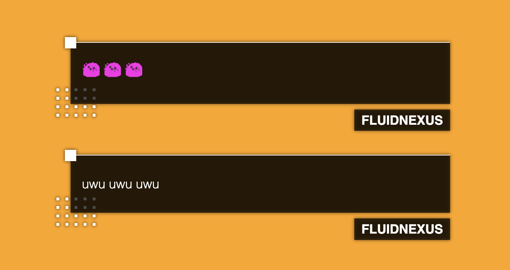

Based on a design I saw online from [Tofie Mae | fraref](https://twitter.com/TOFIEmusic)
## Install Instructions
1. Login to StreamElement
2. In the left navigation bar under Streaming tools, navigate to My overlays
3. Create new or use existing overlay
4. Add a new Custom Widget by clicking on the plus button > Static/Custom > Custom Widget
5. In Settings dropdown menu, click Open Editor
6. Add all the files from this repo to Editor and click done.
7. Set the Size of the widget to 
  Width: 640px

